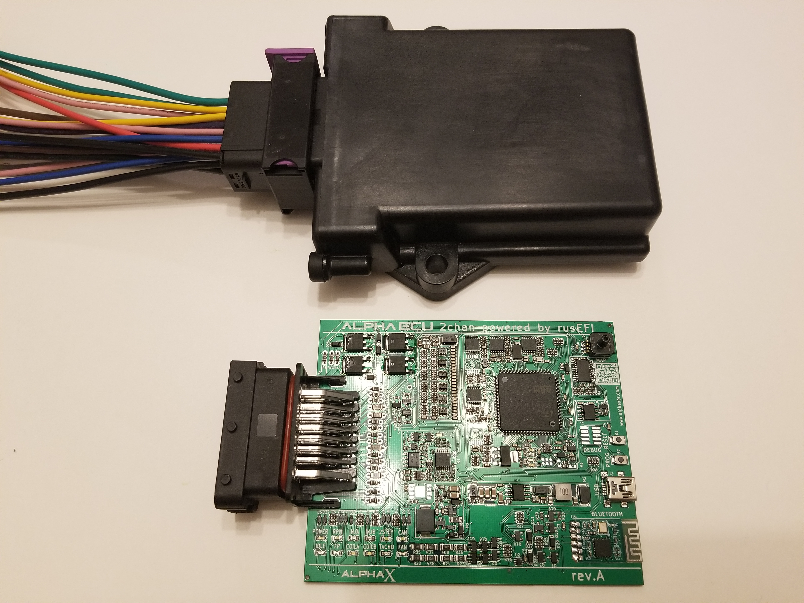

# AlphaX 2Chan

[AlphaX](https://www.alphaxpr.com/)

[Download release firmware](https://github.com/gerefi/gerefi/releases/latest/download/gerefi_bundle_alphax-2chan.zip)

[Snapshot firmware bundle](https://gerefi.com/build_server/gerefi_bundle_alphax-2chan.zip)

[Pinout](https://gerefi.com/docs/pinouts/hellen/alphax-2chan/)

[iBom rev F](https://gerefi.com/docs/ibom/alphax_2ch-f-ibom.html) [iBom rev E](https://gerefi.com/docs/ibom/alphax_2ch-e-ibom.html)
[iBom rev D](https://gerefi.com/docs/ibom/alphax_2ch-d-ibom.html)[iBom rev C](https://gerefi.com/docs/ibom/alphax_2ch-c-ibom.html)[iBom rev B](https://gerefi.com/docs/ibom/alphax_2ch-b-ibom.html)

[Issue tracker & hardware files](https://github.com/gerefi/alphax-2chan)

Hello. [AlphaX 2Chan](https://gerefi.com/build_server/gerefi_bundle_alphax-2chan.zip)

On-board MPXH6400A

[See also AlphaX-4chan](AlphaX-4chan)

## Q: how many injectors per channel?

A: VND14NV04TR-E 93mJ 18A. In terms of current and switching energy those could handle _many_ injectors per channel, maybe a dozen?

## Changelog

### rev G

- [MAX9924 for VR](https://github.com/gerefi/alphax-2chan/issues/100)

### rev F

- [MAP sensor moved to safer location](https://github.com/gerefi/alphax-2chan/issues/94)
- [auxiliary 10 pin molex](https://github.com/gerefi/alphax-2chan/issues/93)

rev E:
December 2022

- migrated to Hellen MegaModule 0.1

rev D:
September 2022

- crank/cam test pads <https://github.com/gerefi/alphax-2chan/issues/63>
- TSOP-10 TLS115 <https://github.com/gerefi/alphax-2chan/issues/64>

rev C:

- pull-down fixed <https://github.com/gerefi/alphax-2chan/issues/40>
- affected by BOM issue p-channel mosfet <https://github.com/gerefi/alphax-2chan/issues/53>

rev B:

- affected by BOM issue p-channel mosfet <https://github.com/gerefi/alphax-2chan/issues/53>
- BT fixed
``
bluetooth_jdy 115200 alphax 1234
``

rev A:

- affected by BOM issue p-channel mosfet <https://github.com/gerefi/alphax-2chan/issues/53>
