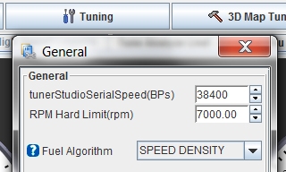
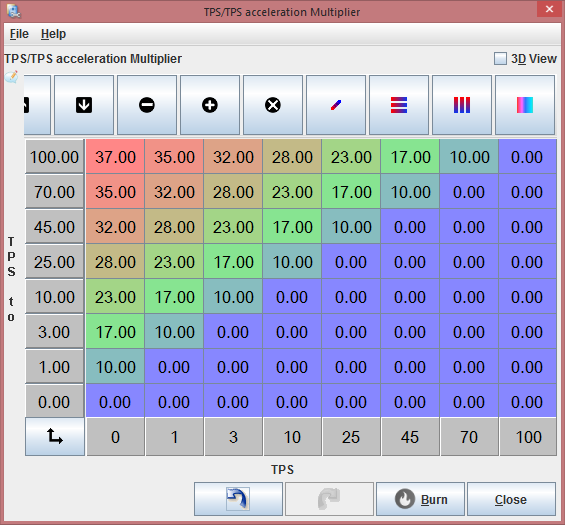

# Fuel control overview

The Air Fuel Ratio (AFR) is controlled by how much fuel is delivered to the cylinder for combustion. There are many factors and many sensors that come into play when trying to determine how much O2 is in the cylinder. gerEFI collects this information and makes a guess about how much O2 is in the cyl, then gerEFI has to determine how much fuel is needed to get the expected AFR and deliver that fuel charge. Below is a graphic that shows some common differences in AFR for a particular Toyota engine. Other engines are similar to this, but may have a different peak power area, or peak efficiency area, etc. To know this information for your particular setup you would need to run it on a Dyno, and determine the exact AFR's.

Most people who are installing tune-able ECU's like gerEFI are looking for more power at the track. However your fuel weight advantage is also commonly important. So it is common that an engine will be tuned for peak power when over a certain load, and peak economy when at a cruise load. OEM's are often concerned with minimal environmental impact, so they may tune to a different AFR. Once you have decided on what your AFR strategy is going to be, you'll have to tune gerEFI to deliver that strategy. As well you will probably use a wide band oxygen sensor to measure your AFR and ensure that you are meeting your desired AFR target.

## Supported fuel control algorithms

gerEFI supports mono, individual/sequential and batched fuel injection using one of the following fuel control algorithms:

1. MAF-based or MAP-based table fuel lookup with interpolation - these algorithms only use the raw sensor output and thus they do not account for ambient air temperature, this is only intended as a minimum viable hardware configuration and we would suggest using the AlphaN, Speed Density or MAF air charge methods instead.

2. TPS-based table fuel lookup with interpolation (Alpha-N)

3. MAP-based Speed Density model, with fuel auto-tune provided by a fully registered copy of TunerStudio

4. MAF based air charge model that computed the air mass in the cylinder and thus the required fuel quantity from the direct measurement of the mass air flow.

Wideband Oxygen Sensor is pretty much a requirement for both manual and auto-tuning.

Within each fuel calculation mode there is coolant temperature correction ("warm-up mode"), battery voltage correction and injector open time ("injector lag") correction.

Commands related to injector lag:

set_flat_injector_lag LAG

set_injector_lag VOLTAGE LAG

set targetvbatt VOLTS

sequential: set injection_mode 1

batch: set injection_mode 2

gerEFI could be used with MAF sensors sending out voltage (like Mazda Miata) or current (like Ford Aspire).

(also some content at [this forum thread](http://gerefi.com/forum/viewtopic.php?f=2&t=1124))

## I/O settings

Here are examples of some relevant commands:

set_injection_pin 1 PB7

fuelbench 100 200 10a

## Full Formulas

### Alpha-N

TPS-based table fuel lookup with interpolation (Alpha-N)

fuel_squirt_duration = injector_lag_curve_lookup(V_BATT) + warm_up_curve_lookup(COOLANT_TEMPERATURE) *intake_air_correction_curve_lookup(INTAKE_AIR_TEMP)* fuel_table_lookup(RPM, TPS)

where TPS is the reading at the start of engine cycle

### MAF

MAF-based table fuel lookup with interpolation

fuel_squirt_duration = injector_lag_curve_lookup(V_BATT) + warm_up_curve_lookup(COOLANT_TEMPERATURE) *intake_air_correction_curve_lookup(INTAKE_AIR_TEMP)* fuel_table_lookup(RPM, MAF)

where MAF is the reading at the start of engine cycle

## Auto tune

Fuel map auto-tune is a process of automatically preparing the configuration table based on the information gathered while vehicle is being operated. At the moment we rely on EFI Analytics Tuner Studio for fuel map (MAF mode) or VE map (Speed Density mode).

## Closed loop correction

Last but not least closed-loop fuel correction dynamically corrects fuel to match target AFR. The better your maps are, the better your actual AFR would be as is. Closed-loop correction is the tool to fix the gap between your maps, our models and reality.

## Acceleration Enrichment

### Why Do We Need It?

**(This only applies to gasoline engines; other fuels may react differently)**

In order for the engine to run, the cylinders must be supplied with a combustible mixture of air and fuel. Under static or quasi-static conditions, the basic fuel algorithms take care of that. But under dynamic conditions in the intake area, especially with a quick change in throttle position things are different. Fuel enters the cylinder as a mix of evaporated fuel and droplets on most injected engines. How much evaporated fuel the air can hold depends on several factors, but most importantly on temperature of the air and pressure.

Pressing down on the gas pedal increases the pressure in the intake manifold which has the effect that it can't hold as much evaporated fuel anymore. As a result, some of the fuel contained in the air deposits on the intake runner walls. This is especially true coming off a strong vacuum such as idle or slow cruise/coast. Now this fuel is not available for combustion, creating a lean condition. This has to be corrected for and that's what acceleration enrichment is mostly about. There are plenty of other effects going on, such as the “puddle of fuel” that is explained under the wall-wetting theory. The main point is: When the pressure in the intake increases rapidly, we create a temporary lean condition.

Of course the opposite is true as well: When lifting off the gas pedal, suddenly the pressure in the intake drops and the air can hold more fuel vapor which it will suck off the intake walls. This creates a temporary rich condition. This usually isn't harmful to how the engine is running, but it's detrimental to fuel efficiency and the environment.

### TPS Delta Strategy

TPS-movement can be used as a predictor of change in MAP. This is equivalent to the accelerator pump on carbureted engines. A slow push on the pedal (small delta) causes very little or no enrichment (dumped fuel), whereas a hefty stomp on the pedal and rapid movement result in a big additional shot of fuel.

The advantage of TPS based enrichment is that it reacts very quickly and can react to small amounts of change at or near closed throttle. The disadvantage is that it can’t react to changes in MAP that are not caused by a change in throttle position, like a turbo-charger spooling up. Usually a mix of load-based and TPS-based enrichment is employed.

#### Explanation of parameters

The parameters for TPS-based enrichment have the same meaning as the Engine-Load based parameters. However, there is no multiplier- this is taken care of in a separate table.

#### TPS/TPS acceleration extra fuel

TODO: fix error - we do not add 10% extra fuel, we add 10ms extra fuel! not multiplier any more, just extra fuel

This table defines the amount of additional fuel injected, based on throttle movement. The X-Axis is the “From” TPS and the Y-Axis is the “To” TPS. So if the TPS changes from ‘0%’ to ‘1%’, we add 10% fuel. In the above table, if TPS changes from ‘0’ to ‘3’ the firmware adds 17% fuel.

Why so complicated? A throttle-body is not a linear device. Cracking it slightly open from completely closed will cause much more of an increase in MAP than opening it the last percent from 99% to 100%. This table allows to adjust for this degressive behavior.

In future more adjustments may be needed- for example at low rpms a throttle that is just 10% open may essentially be considered fully open, since it does not cause a significant restriction to the low airflow, so opening the throttle from 10% to 100% may have only a negligible effect on MAP. But at high rpms there will still be a significant change in MAP, Even when the position changes from 90% to 100%. A calibration table for this behavior may be required in order to be able to tune enrichment perfectly.

#### To Do

1. Come up with a strategy on how to deal with cumulative effects. Example: Push down on the gas pedal. What if that process takes longer than one engine rotation?

   **Example:**
   | Rotation in deg | Throttle Pos | Addtl. fuel current | Addtl. Fuel Taper
   | - | - | - | - |
   | 0 | 0 | 0 | 0 |
   | 360 | 2 | 13 | 0 |
   | 720 | 4 | 5 | 8 |

   Should the fuel from the current change and the previous taper be added up? Or averaged? Or should the latest change completely override the previous change?

2. Deal with warming up. During warmup more additional fuel is needed. We need a setting to adjust for that.

#### Tuning Strategy

The point of enrichment tuning is to keep the engine from bogging down when stepping on the throttle. While it would be great to maintain perfect AFRs while this is happening, that goal is currently not realistic. OEM ECUs don’t get it perfect either.

A gasoline engine will run without noticeable bogging at AFRs between 9 and 16, maybe 17 or so. So we’re shooting to stay within a very wide corridor.

On tuning there seem to be two main conflicting theories:

- Use mainly Load-based enrichment and fix the little blips that can’t be tuned with load-based enrichment by TPS-based.
- Use mainly TPS-based enrichment and add a little bit of load-based enrichment to fix what TPS-based can’t take care of.

Either way seems to work eventually. Lots of trial and error will be needed to get this just right.

Pointers:

- Only tune enrichment on a fully warmed up engine

- Very sharp throttle movements are the hardest to tune, start with more gentle movements first

- You can tune for sudden throttle-stabs without driving, just sitting in idle

- The goal is drivability. If you don’t notice any bogging, no matter what you do with the throttle, you’re good- stop right there, no matter what your AFRs are
