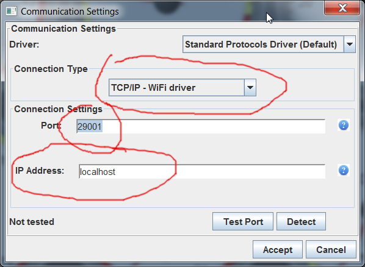

# Remote Tuning

Remote tuning is possible over Internet using gerEFI TunerStudio plugin if gerEFI ECU is connected to the internet.

There are three ways to connect gerEFI to internet:

1) "Broadcast" tab of gerEFI TunerStudio plugin.
2) gerEFI network_connector tool running for instance on Raspberry Pi or similar Single Board Computer
3) [gerEFI Android application](gerEFI-Android)

Connecting to remote ECU is a two step process:
First you connect gerEFI TunerStudio plugin to remote controller via Internet, and then you connect TunerStudio to gerEFI TunerStudio plugin locally. IP Address "localhost" Port default value 29001.

