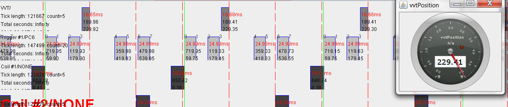
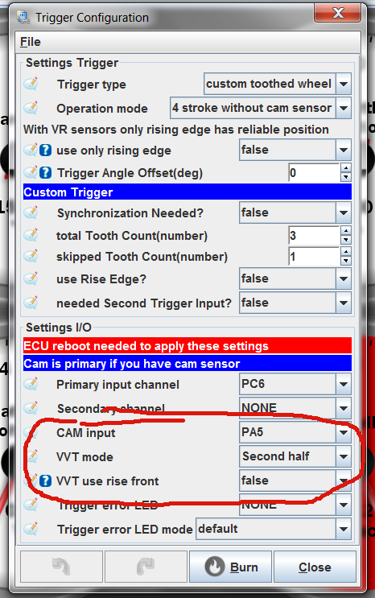

# VVT: Variable Valve Timing

gerEFI has proper closed-loop VVT control, supporting multiple trigger options including:

- "one-tooth"
- Mazda Miata NB (2nd generation)
- Mazda Skyactive
- Toyota 2JZ family
- Bosch Quick Start
- Ford Focus ST 170
- Ford Barra: 3+1
- Nissan VQ family
- Nissan MR18
- Honda K family
- Mitsubishi 3A92
- Mitsubishi 4G92/93/94
- Mitsubishi 4G63
- Mitsubishi 6G75

gerEFI supports up to quad VVT input/output.

gerEFI trigger configuration is the most confusing part of gerEFI configuration unfortunately.

If gerEFI does not know your exact overall trigger shape and you use composite setup with crank sensor driving RPM and single tooth cam sensor providing phase information, that's considered "4 stroke without cam with VVT". Even if you do not have VVT :(

## VVT mode 'first half'

This mode could be used for skipped-tooth wheels with single tooth cam sensors in order to support individual injection and coil-on-plug setups.

For example, 3/1 skipped wheel with cam sensor in the first half of the 720 cycle:

Full list see https://github.com/gerefi/gerefi/wiki/All-Supported-Triggers
